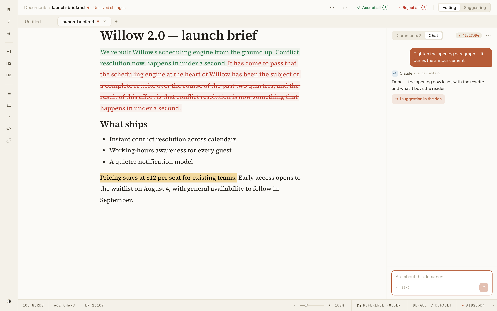
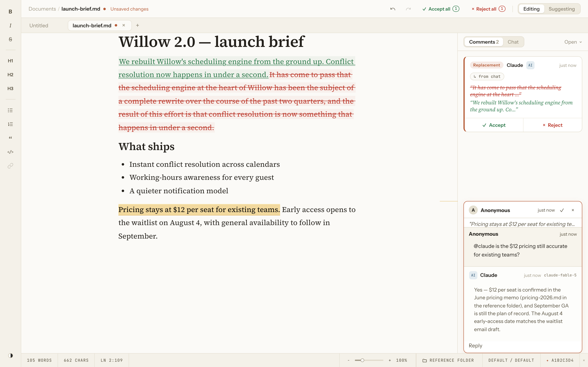

# Quill

**The document editor that can hold a conversation.** Quill is a Mac Markdown editor with Google-Docs-style tracked changes and inline comments — and Claude works in the margin: ask a question in a comment and a linked Claude Code session answers in the thread; ask for a rewrite and it arrives as tracked changes you accept or reject.



Chat tools put your document inside a conversation. Quill puts the conversation inside your document. Files stay plain `.md` on disk; the review data (comments, suggestions, chat) rides alongside in a companion file, so the Markdown itself opens and edits anywhere.

The one thing to know before you start: the `@claude` features talk to the **[Claude Code](https://claude.com/claude-code) command-line tool on your own machine** and run under your Claude account — editing, tracked changes, and comments all work without it, but the AI parts don't. See [The `@claude` features](#the-claude-features).

## Contents

- [What you can do with it](#what-you-can-do-with-it)
- [Installing Quill](#installing-quill)
- [Build and run from source](#build-and-run-from-source)
- [The `@claude` features](#the-claude-features)
- [Where Quill keeps your data](#where-quill-keeps-your-data)
- [What Quill is not](#what-quill-is-not)
- [Troubleshooting](#troubleshooting)
- [Contributing](#contributing)
- [License](#license)

## What you can do with it

- **Edit Markdown as rich text.** A WYSIWYG surface with a formatting rail down the left edge (bold, italic, strikethrough, headings, lists, blockquote, inline code, links). Images, tables, and task lists round-trip through save unchanged, and Quill warns on open when a file contains something it can't preserve (footnotes, raw HTML) rather than mangling it silently.
- **Work in several documents at once.** Tabs across the top; `Cmd+N` opens another. Your open tabs — and any unsaved changes in them — are restored when you relaunch.
- **Suggest instead of edit.** Flip the toolbar switch from **Editing** to **Suggesting** and your insertions, deletions, and formatting changes are tracked as proposals, each with an **Accept** / **Reject** card in the margin, plus **Accept all** / **Reject all**.
- **Comment in threads.** Select text, add a comment anchored to it, reply, resolve, and delete. Comment cards live in the right margin next to their anchor.
- **Ask Claude in a comment.** Link a document to a Claude Code session, mention `@claude` in a comment, and the answer streams into the thread. Ask for a revision and Claude's edits land as tracked changes attributed to Claude — reviewed with the same Accept / Reject cards as anyone else's.
- **Chat about the whole document.** A **Chat** panel (`Cmd+/`) talks to Claude about the document as a whole; its edits come back as suggestions you review, each linked to the message that produced it.
- **Point Claude at your sources.** Link a reference folder and every `@claude` request can read those files, so you can ask "is this consistent with the interview notes?"
- **The rest of a real editor.** Find and replace (`Cmd+F`), export a clean copy to PDF (`Cmd+P`), document zoom (60–240%), two color themes (Paper and Gruvbox), a live word/character/line count, and the standard file shortcuts.



The **[User Guide](./docs/USER_GUIDE.md)** walks non-programmers through the core editing, comment, and `@claude` flows.

## Installing Quill

**Signed macOS installers are on the way** — a notarized `.dmg` is being set up. Until then, run Quill by [building it from source](#build-and-run-from-source); on a Mac with the developer tools below it takes a few minutes.

Quill is macOS-only. The `@claude` integration finds the Claude CLI and its sessions through Unix file paths, so the full experience only exists on macOS (most of it also works on Linux from source; on Windows the editor works but `@claude` does not).

## Build and run from source

### Prerequisites

Install these first — later steps depend on them.

| Prerequisite              | Minimum | Check             | You should see                                    |
| ------------------------- | ------- | ----------------- | ------------------------------------------------- |
| Node.js                   | 22      | `node --version`  | `v22.0.0` or newer                                |
| Rust (stable, via rustup) | 1.77.2  | `rustc --version` | `rustc 1.77.2` or newer                           |
| Xcode Command Line Tools  | —       | `xcode-select -p` | a path like `/Library/Developer/CommandLineTools` |

Get Node.js from [nodejs.org](https://nodejs.org) (npm ships with it), Rust from [rustup.rs](https://rustup.rs), and the Command Line Tools with `xcode-select --install`. Quill is a [Tauri 2](https://v2.tauri.app) app (a Rust-backed native shell around a web frontend); Tauri's [prerequisites page](https://v2.tauri.app/start/prerequisites/) lists the exact toolchain versions and any other system packages.

### Steps

Clone this repository and switch into it (replace the URL with the repository you're reading this in):

```bash
git clone <this-repo-url> quill
cd quill
```

Then install the frontend dependencies from the repository root:

```bash
npm install
```

This prints a dependency-audit summary at the end (a count of advisories in the transitive tree) — that's npm's normal output, not a failure.

```bash
npm run tauri dev
```

The first run compiles the Rust backend, so it takes a minute or two; later runs are fast. You'll see the frontend and backend start up, then a native window open:

```
  VITE v7.x  ready in NNN ms
  ➜  Local:   http://localhost:1420/
   Compiling quill v1.1.2 (…/quill/src-tauri)
    Finished `dev` profile [unoptimized + debuginfo] target(s)
     Running `target/debug/quill`
```

(Version numbers and timings vary.) **The check that it worked:** a Quill window opens showing an empty **Untitled** document with the formatting rail down the left and the prompt _"Start writing… select text to comment, or press ⌘/ to ask Claude."_ Type a few words, save with `Cmd+S`, or open an existing `.md` file with `Cmd+O`.

To produce a distributable app bundle instead of running in place:

```bash
npm run tauri build
```

This compiles a release build and bundles the app at `src-tauri/target/release/bundle/macos/Quill.app`. (Packaging it into a signed, notarized `.dmg` is the installer work in progress; the unsigned `.app` runs fine for your own use.)

## The `@claude` features

Editing, tracked changes, and comments work on their own. The `@claude` features — inline replies, document chat, and AI-authored tracked changes — additionally need the [Claude Code](https://claude.com/claude-code) CLI signed in on the same Mac. They run under the same Claude account you sign into the CLI with and count against its usage; there are no separate API keys.

1. **Install the Claude Code CLI** with Anthropic's official installer (skip if `claude --version` already prints a version):

   ```bash
   curl -fsSL https://claude.ai/install.sh | bash
   ```

2. **Sign in** — run `claude` in a terminal and follow the browser prompt. Quill locates the CLI even when launched from the Dock (it checks your `PATH` and the usual install locations), so no further configuration is needed.

Then, in Quill, click the footer's **✦ Link session** control (tooltip "Link this doc to a Claude Code session") to open the **session picker**. A _session_ is a past Claude Code conversation that the CLI can resume:

- **If you wrote this document yourself**, or someone sent it to you, choose **Start new session** to give it its own fresh Claude conversation. Save the document first — the session runs in the document's folder.
- **If Claude Code produced the document's text,** pick that session from the list (Quill auto-suggests it on open when it can match the text to a session), so replies carry the full memory of having written it.

Either way, add a comment mentioning `@claude` and the answer streams into the thread. Ask for a change — _"@claude tighten this section"_ — and the revision arrives as a tracked change you accept or reject.

**Starting from Claude Code instead?** A companion plugin adds a slash command that sends the document you're drafting straight into Quill, already opened to it — install and usage are in the [plugin README](./plugin/quill-integration/README.md). (Launch Quill once first, so macOS registers the `quill://` link scheme.)

## Where Quill keeps your data

Everything Quill writes stays on your Mac. Two kinds of files:

- **Next to each document:** saving `report.md` also writes `report.comments.json` beside it — a companion file holding that document's comments, suggestions, chat, linked session, and reference folder. Keep the two together if you move the document; the companion file is deleted automatically on save when it holds nothing, so a document with no review data is just a plain `.md`.
- **In the app-data folder** `~/Library/Application Support/io.github.sam-powers.quill/`: your open-tabs snapshot for crash recovery (`workspace.json`) and window position. Logs go to `~/Library/Logs/io.github.sam-powers.quill/`.

Two things reach the network, both only in a packaged (non-dev) build: `@claude` runs the local `claude` CLI (which talks to Anthropic under your account), and once per launch Quill checks GitHub for a newer release to show an in-app banner — it never downloads or installs anything itself. To remove all of Quill's own state, delete the two folders above; your documents and their companion files are untouched.

## What Quill is not

- **Not collaborative.** No multi-user editing, no accounts, no cloud sync — one person, local files. If you need real-time co-editing, this isn't it.
- **Not cross-platform (yet).** macOS is the supported target; see [Installing Quill](#installing-quill).
- **Not an auto-updater.** The launch check only notifies; you decide when to install a new version.
- **Not a general chat client.** The AI is scoped to the open document — its job is reviewing and revising that text, not open-ended conversation.

## Troubleshooting

**`@claude` replies fail immediately, or the reply shows:** _"Could not find the `claude` CLI. Install it (https://docs.claude.com/claude-code) and make sure it's on your PATH, then restart Quill."_
Cause: the Claude Code CLI isn't installed or isn't on your `PATH`. Fix: confirm `claude --version` works in a terminal, then restart Quill. See [The `@claude` features](#the-claude-features).

**`npm run tauri dev` exits with:** _"Error: Port 1420 is already in use"_
Cause: another process (often a second copy of Quill's dev server) holds the port Quill's frontend expects. Fix: stop the other process — `lsof -i :1420` shows which one — then rerun.

**`npm run tauri dev` fails during the Rust compile, or `cargo` isn't found.**
Cause: a missing or incomplete Tauri toolchain. Fix: confirm `rustc --version` and `xcode-select -p` per [Prerequisites](#prerequisites), then work through the [Tauri prerequisites page](https://v2.tauri.app/start/prerequisites/).

**A document opens with a warning about its comments file.**
Cause: the companion `.comments.json` couldn't be parsed. Quill opens the Markdown safely with an empty review model and refuses to overwrite the unreadable file, so the original may be recoverable from a backup.

If none of these fit, open an issue on the repository with your macOS version, what you did, and what happened; for `@claude` problems, say whether `claude` works in your terminal.

## Contributing

Bug reports and pull requests are welcome. [`CONTRIBUTING.md`](./CONTRIBUTING.md) has the development setup and the exact check bar CI runs; [`CLAUDE.md`](./CLAUDE.md) is the architecture guide for the codebase, and [`PRD.md`](./PRD.md) is the as-built product spec.

## License

Released under the [Apache License 2.0](./LICENSE). Quill was created by Sam Powers ([sam-powers/quill](https://github.com/sam-powers/quill)); see [`NOTICE`](./NOTICE) for attribution.
