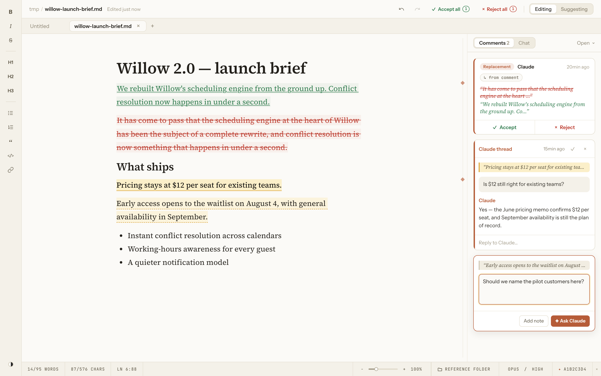
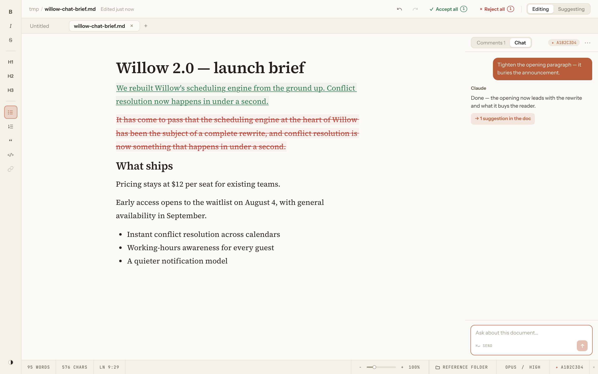
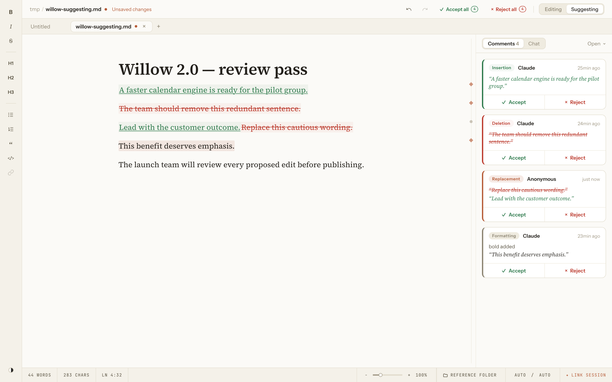

# Quill

A Mac Markdown editor where Claude is a collaborator inside the document — it answers comments and proposes tracked changes you accept or reject, right where you're writing.



Quill is for writing and revising Markdown documents — briefs, memos, specs, docs drafted with Claude Code — when you want a second set of hands in the draft, not in a separate chat window. You select a passage, ask Claude to tighten or fact-check it, and its edits land as tracked changes in the margin. You keep the ones you like. Your files stay ordinary `.md` on disk, so anything else can still read them.

It works like Google Docs' suggesting mode, but the reviewer is Claude, the file is plain Markdown on your own Mac, and Quill keeps to itself — no telemetry, no update checks, no account of its own to sign into. The requests you make to Claude run through your own Claude account.

> **The one thing to know before you start:** Quill is an internal Trussworks build, installed by copying the app from the team's Google Drive (see [Installing Quill](#installing-quill)), and its AI features need the [Claude Code](https://claude.com/claude-code) command-line tool signed in on the same Mac (see [Turn on the Claude features](#turn-on-the-claude-features)). Everything except the Claude features works without it.

## What it looks like to use it

The core loop is select → ask → review:

1. Open a Markdown file — or just type into the **Untitled** document Quill starts with — and select a sentence or paragraph.
2. A **+** button appears next to it. Click it and the composer opens, anchored to your selection, with two buttons: **Add note** (a private note — not sent to Claude unless you later promote it with **Ask Claude about this**) and **Ask Claude**. The highlight frames your request, but Claude receives the **full current document**, so it can answer or edit wherever the request calls for — not only inside your selection.
3. Type a request — _"tighten this,"_ _"is this accurate against the interview notes?"_ — and click **Ask Claude** (or press ⌘↩).
4. Claude's answer streams into the comment thread. If you asked for edits, its revisions appear **in the document as tracked changes attributed to Claude** — each with an **Accept** / **Reject** card in the right-hand panel. The proposed text stays visibly marked until you accept or reject it — Quill never silently commits a final version.

For a whole-document pass — _"make this 20% shorter," "check every date against the source"_ — open the **Chat** panel (⌘/) instead of commenting paragraph by paragraph. Chat reads the full document every turn and returns its edits as the same reviewable tracked changes.



_The **Chat** panel works on the whole document; its edits come back as tracked suggestions you accept or reject, and it never leaves margin comments._

Alongside the Claude features, Quill is a capable Markdown editor in its own right: two color themes, a left-edge formatting rail, find & replace, tabs for several documents at once, comments and manual tracked changes without any AI, and export to a clean PDF. The [User Guide](docs/USER_GUIDE.md) is a plain-language walkthrough.

## Requirements

| What you need                                  | Version                                                                        | How to check                           | You should see                                        |
| ---------------------------------------------- | ------------------------------------------------------------------------------ | -------------------------------------- | ----------------------------------------------------- |
| A Mac                                          | Apple Silicon or Intel; built and tested on macOS 26 (older macOS is untested) | Apple menu → **About This Mac**        | Your Mac model and macOS version                      |
| Google Drive for Desktop                       | Any current version, signed into your Truss account                            | Finder sidebar under **Locations**     | A **Google Drive** entry that opens the shared drives |
| Claude Code CLI — only for the Claude features | Any current version                                                            | Run `claude --version` in **Terminal** | A version line, e.g. `2.1.208 (Claude Code)`          |

Google Drive for Desktop is at [google.com/drive/download](https://www.google.com/drive/download/); the Claude Code CLI is at [claude.com/claude-code](https://claude.com/claude-code). You can install Quill and edit Markdown without Claude Code — you just won't have the Ask Claude or Chat features until it's installed and signed in.

## Installing Quill

Quill is shipped inside Trussworks as a ready-to-run Mac app on the team's Google Drive. It is **not** Apple-notarized, so how you copy it matters: a copy that arrives through Google Drive's **Finder sync** normally has no download quarantine and opens cleanly, while one pulled from the Drive **website** (or any browser download) is typically quarantined and trips macOS Gatekeeper. Use Finder.

1. In Finder, open your synced Google Drive and go to **Shared drives → Truss → Engineering → Tools**.
2. Drag **Quill.app** from that folder into your **Applications** folder.
3. Open **Applications** and double-click **Quill**.

**Check it worked:** Quill opens to an empty **Untitled** document with a formatting rail down the left edge and a status bar along the bottom. No "unidentified developer" or "Apple could not verify" dialog should appear. If one does, you copied a quarantined file — see [Troubleshooting](#troubleshooting).

That's the whole install. Your documents are saved wherever you choose — never inside the app. Quill keeps its own local data under your Library folder (identifier `com.trussworks.quill`): your preferences (theme, zoom, recent files, model choices), a `workspace.json` crash-recovery snapshot in **Application Support**, and a rotating log in **Logs**. The recovery snapshot holds your open tabs — including the contents of any not-yet-saved document — so unsaved work survives a crash or restart.

> If you used an **earlier, pre-Trussworks build** of Quill, this one starts with fresh settings (theme, zoom, recent files, model choices) because the app's identity changed. Your documents and their `.comments.json` companion files are untouched. Details are in the [v1.1.7 release note](docs/release-notes/v1.1.7.md).

### Updating

There is no in-app updater. When a new build is posted to the same Drive folder, quit Quill, drag the new **Quill.app** into **Applications** (replacing the old one), and open it again. Your documents and settings carry over.

## Turn on the Claude features

The Ask Claude and Chat features run Claude through the Claude Code CLI on your Mac, under **your own Claude account** — there are no API keys to set up, and the requests count toward that account's usage. Quill sends no telemetry and checks for no updates of its own.

1. **Install and sign into Claude Code.** Follow [claude.com/claude-code](https://claude.com/claude-code) to install the CLI, then run `claude` once in Terminal and complete the sign-in. Confirm it works: `claude --version` prints a version line. Quill finds the `claude` command automatically afterward, even when launched from the Dock.
2. **Link the document to a session.** A **session** is one Claude Code conversation; linking it lets Claude answer with that conversation's memory. In Quill's status bar, click **✦ Link session**, then pick an existing session — or, for a document Claude didn't write, save it first and choose **Start new session** to give it a fresh conversation of its own. If Claude Code wrote the document's text, Quill usually suggests the right session the moment you open the file.
3. **Ask.** Select text, click **+**, type a request, and press **Ask Claude** (⌘↩).

**Check it worked:** the reply streams into the comment thread within a few seconds. Ask for an edit (_"tighten this sentence"_) and a tracked change with **Accept** / **Reject** appears in the document. If the reply fails instantly, see [Troubleshooting](#troubleshooting).

## Everyday use

The [User Guide](docs/USER_GUIDE.md) walks through Quill in plain language; the essentials:

- **Comments and Ask Claude** — Select text → **+** → **Add note** (private — not sent to Claude unless you promote it with **Ask Claude about this**) or **Ask Claude**. A Claude thread takes follow-up replies that continue with Claude; a private note has an **Ask Claude about this** button to hand it over later.
- **Suggesting mode** — The top-bar **Editing / Suggesting** switch. In Suggesting mode your own edits become tracked changes too (insertions, deletions, and formatting like bold or strikethrough), each with an Accept / Reject card; **Accept all** / **Reject all** clear the batch. Editing mode applies changes directly.
- **Chat about the whole document** — The **Chat** tab in the right panel, or ⌘/. It reads the full document each turn and returns tracked-change suggestions; it never leaves margin comments.
- **Reference folders** — Click **REFERENCE FOLDER** in the status bar and point it at a folder of source material (notes, PDFs, data). Claude may then read those files, so you can ask it to check the document against them.
- **Model and effort** — Two status-bar dropdowns pick the Claude model (**AUTO**, or `fable` / `opus` / `sonnet` / `haiku`) and effort (**AUTO**, or `low` … `max`) for the next request. **AUTO** lets Claude Code choose; after a request, an AUTO dropdown reports the **most recently observed** value — the model family it saw (like `OPUS`) and the effort.
- **Tabs, find, zoom, themes** — Several documents open as tabs (⌘N for a new one); ⌘F is find & replace; ⌘ +/−/0 zooms 60–240%; the button at the bottom of the rail toggles the Paper and Gruvbox themes. Your open tabs reopen the next time you launch.
- **Sharing** — **File → Export to PDF…** (⌘P) makes a clean copy for people who don't have Quill. To share the editable document, move its files yourself; there's no cloud sharing (see [What Quill is not](#what-quill-is-not)).



_In **Suggesting** mode, every change — your own or Claude's — is tracked: insertions, deletions, replacements, and formatting each get an Accept / Reject card._

**Saving and data safety.** A saved document **autosaves** in the background — a couple of seconds after you stop typing, and whenever you switch away from it. An **Untitled** document has nowhere to save to yet, so save it once (⌘S) to start autosaving. If a file changes on disk while you have it open — which happens when **Google Drive syncs an edit from another machine** — Quill won't overwrite blindly: it pauses saving and shows a banner offering **Overwrite**, **Save a Copy**, or **Reload**. Unsaved and Untitled work is also kept in the crash-recovery snapshot, so your tabs come back if Quill or your Mac restarts.

**Files and privacy.** Each saved document is a portable `<name>.md`, plus a `<name>.comments.json` companion file next to it whenever there's review data to store. That companion holds your **comments, private notes, suggestions, chat, and the links to the Claude session and reference folder** (including the session id and folder paths). A **private note** stays out of Claude's context unless you later promote it with **Ask Claude about this** — but it is always written to `.comments.json`, so sharing that file shares your notes too. To pass a document along without the review data, share only the `.md`; if it still has unresolved suggestions, accept or reject them first (a pending suggestion leaves both the old and proposed text in the `.md`) or use **Export to PDF** for a clean, accepted copy.

One more privacy note: like any Markdown viewer, opening a document that contains a remote `https://` image fetches it, which tells that image's host that the file was opened and reveals your IP address (the request carries no document content). Local and relative images stay on your Mac.

## What Quill is not

- **Not a real-time collaboration tool.** One person edits a document at a time. Quill has no account or sign-in of its own, no cloud sync, and no shared live cursors. Multiple documents open as tabs in a single window, not multiple windows. If you need Google-Docs-style multiplayer editing, use Google Docs.
- **Not a general chat client.** Claude works on the open document (a comment thread or the whole-document chat), not as a free-standing assistant.
- **Not cross-platform.** macOS only. The AI features rely on Unix-style discovery of the Claude Code CLI, so Windows and Linux are not shipped.
- **Not a signed, public release.** This is an internal build that **isn't Apple-signed or notarized**, distributed over Google Drive rather than the App Store or a website. Treat it as internal Trussworks software.
- **Not a full-fidelity Markdown converter.** Footnotes and raw HTML aren't supported; Quill warns you when you open a file that uses them, because saving from Quill would alter those parts.
- **PDF export is a clean copy only.** It renders the document as if every suggestion were accepted; there is no "export with the tracked changes and comments visible" markup view.

## Troubleshooting

**Quill won't open: *"Apple could not verify 'Quill' is free of malware"* or *"Quill Not Opened"* with only a **Move to Trash** button.**
Cause: the copy you have is quarantined — most likely pulled from the Drive website's Download button or a browser rather than the synced Finder folder. Fix: delete that copy and reinstall by dragging **Quill.app** from the synced **Shared drives → Truss → Engineering → Tools** folder ([Installing Quill](#installing-quill)). If you must use a copy you already have, open **System Settings → Privacy & Security**, scroll to the message about Quill, and click **Open Anyway**, then authenticate.

**Ask Claude or Chat fails immediately, or the ✦ link picker is empty.**
Cause: the Claude Code CLI isn't installed or isn't signed in — or you simply haven't picked a session yet. Fix: in Terminal, confirm `claude --version` prints a version and that running `claude` signs you in. Then, in Quill, click **✦ Link session**; if the list is empty, save your document and choose **Start new session** to create one for it — you don't need to open a session in Terminal first. See [Turn on the Claude features](#turn-on-the-claude-features).

**A document opens with a warning about its comments file.**
Cause: the `<name>.comments.json` companion file next to the document couldn't be read (corrupted or truncated). Fix: Quill opens the Markdown text safely with an empty review panel and refuses to overwrite the damaged companion file, so your comments may be recoverable from a backup or from Google Drive's version history. The Markdown itself is unaffected.

**Settings, recent files, or a linked session reset after an update.**
Cause: expected only when moving from a pre-Trussworks build — the app identity changed once, so local settings start fresh. Your documents are untouched. This does not recur on later updates.

For anything else, open an issue on the [trussworks/quill](https://github.com/trussworks/quill/issues) repository — or, if you don't have repo access, reach the owning team, **Trussworks Engineering**. Include your macOS version, what you did, and what happened; **Help → Copy Diagnostics** (app version and OS) and **Help → Show Logs** are handy to attach, and for a Claude problem, note whether `claude` works in your Terminal.

## Build and run from source

You only need this if you're developing Quill; to just use it, follow [Installing Quill](#installing-quill) above.

Quill is a [Tauri 2](https://v2.tauri.app/) desktop app — a React 19 + TypeScript frontend (built with Vite, edited through [Tiptap](https://tiptap.dev/)) over a thin Rust backend. Building needs Node.js 22+, a Rust toolchain, and Tauri's [system prerequisites](https://v2.tauri.app/start/prerequisites/).

```bash
git clone https://github.com/trussworks/quill.git
cd quill
npm install
npm run tauri dev   # launches the desktop app with hot reload
```

[CONTRIBUTING.md](CONTRIBUTING.md) has the full check bar — typecheck, lint, formatting, Vitest, Playwright, and the Rust checks — that a change must pass before it lands, and [PRD.md](PRD.md) is the as-built product spec. Releases are macOS-only, built as a universal app and shared over Google Drive; there's no automated public release channel.

## License and attribution

Quill is licensed under the [Apache License 2.0](LICENSE) (see also [NOTICE](NOTICE)).

This is an internal Trussworks fork of [sam-powers/quill](https://github.com/sam-powers/quill), the original open-source project by Sam Powers. Trussworks maintains the fork; the upstream copyright and Apache-2.0 license are retained.
